<div align="center">

<table>
<tr>
<td valign="top" align="center">
  
</td>
<td valign="top" align="center">
  
</td>
</tr>
</table>



</div>

---

### 👋 Hi, I'm Shubham

Software Engineer focused on **Backend Engineering**, **Distributed Systems**, and **Cloud-Native Technologies**.

`Java` · `Spring Boot` · `Kafka` · `PostgreSQL` · `AWS` · `Kubernetes`

Exploring AI-powered applications through LLM integrations, agentic workflows, retrieval-augmented systems, and developer productivity tools.

Experience designing backend platforms, authentication systems, event-driven architectures, system design tooling, and scalable web applications.

Currently deep-diving into Data Structures & Algorithms, Low-Level Design, High-Level Design, Distributed Systems, and AI-assisted software engineering.

📫 [shubhamnayak0904@gmail.com](mailto:shubhamnayak0904@gmail.com)

---

<details>
<summary>How this README is built</summary>

<br>

Everything above is a self-contained animated SVG. GitHub strips `<script>` and
sanitises almost all inline CSS from READMEs, but it renders SVG — so the
animation is plain SMIL inside the image files. No third-party stats services,
no personal access token, nothing to rate-limit.

| Asset | Built by | Source |
|---|---|---|
| `assets/portrait.svg` | `scripts/prep_photo.py` → `scripts/make_ascii_svg.py` | a photo |
| `assets/infocard.svg` | `scripts/make_infocard_svg.py` | `data/infocard.json` |
| `assets/heatmap.svg` | `scripts/fetch_contributions.py` → `scripts/render_heatmap_svg.py` | public contribution calendar |

Rebuild everything locally:

```bash
pip install -r requirements.txt
make all
```

The heatmap refreshes itself daily via `.github/workflows/update-heatmap.yml`.
The portrait and info card are static — regenerate them with `make portrait`
or `make infocard` after editing `data/infocard.json` or swapping the photo.

</details>
